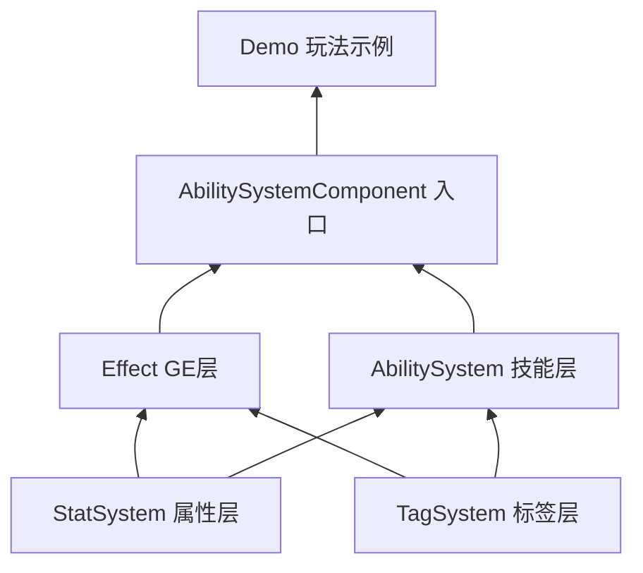

# GAS 源码阅读顺序

> 建议按 **数据层 → 运行时层 → 组件入口 → 玩法示例** 阅读  
> 路径根目录：`Assets/_Scripts/GAS/`

---

## 总览



---

## 第一层：属性系统（一切数值的基础）

先搞懂「属性怎么存、怎么算」。

| 顺序 | 文件 | 关注点 |
|------|------|--------|
| 1 | `Core/StatSystem/StatData.cs` | SO 配置：Passive / Immediate |
| 2 | `Core/StatSystem/StatModifier.cs` | 四阶段修饰符类型 |
| 3 | `Core/StatSystem/IStat.cs` | 属性接口 |
| 4 | `Core/StatSystem/Stat.cs` | Passive 属性聚合计算 |
| 5 | `Core/StatSystem/ImStat.cs` | HP/MP 等即时属性 |
| 6 | `Core/StatSystem/StatController.cs` | 属性字典、增删修饰符 |

**读完后应理解**：`GetCurrentValue` 对 ImStat / Passive 分别走哪条路。

---

## 第二层：标签系统（条件判断）

| 顺序 | 文件 | 关注点 |
|------|------|--------|
| 7 | `Core/TagSystem/GameplayTag.cs` | 层级 Tag、父子匹配 |
| 8 | `Core/TagSystem/GameplayTagContainer.cs` | 增删查、ContainsTag |
| 9 | `Core/TagSystem/GameplayTagRequirements.cs` | Need / Ban 条件 |
| 10 | `Core/TagSystem/TagTest/TagTest.cs` | 小例子，可快速跑一遍 |

---

## 第三层：GameplayEffect（Buff/Debuff 核心）

| 顺序 | 文件 | 关注点 |
|------|------|--------|
| 11 | `Core/Effect/GameplayEffectEnums.cs` | 即时/持续/堆叠/到期策略 |
| 12 | `Core/Effect/GameplayEffectData.cs` | GE 配置 SO |
| 13 | `Core/Effect/GameplayEffectSpec.cs` | GE 运行时实例 |
| 14 | `Core/Effect/GEManager.cs` | **重点**：应用、堆叠、周期、到期、Tag |

**读完后应理解**：

```
ApplyGE
  → ApplyModifiersToStat / ApplyPeriodicEffect
  → UpdateGE
  → Remove
```

---

## 第四层：技能系统（Ability）

| 顺序 | 文件 | 关注点 |
|------|------|--------|
| 15 | `Core/AbilitySystem/GameplayAbility.cs` | 技能 SO 基类 |
| 16 | `Core/AbilitySystem/AbilityCooldown.cs` | CD 计时 |
| 17 | `Core/AbilitySystem/AbilityCost.cs` | 消耗计算 |
| 18 | `Core/AbilitySystem/AbilitySpec.cs` | 技能运行时实例 |
| 19 | `Core/AbilitySystem/AbilityContext.cs` | 单次施法上下文、取消标记 |

---

## 第五层：组件入口（挂角色身上）

| 顺序 | 文件 | 关注点 |
|------|------|--------|
| 20 | `Component/AbilitySystemComponent.cs` | **总入口**：技能激活、GE 转发、Tag |

**调用链**：

```
TryActivateAbility
  → AbilitySpec
  → AbilityContext
  → GameplayAbility

ApplyGE
  → GEManager
```

---

## 第六层：Demo 示例（串起来看）

由简到复杂：

| 顺序 | 文件 | 关注点 |
|------|------|--------|
| 21 | `Demo/DemoScripts/Demo_Player.cs` | 玩家如何调 ASC |
| 22 | `Demo/DemoScripts/So/Ability/Ability_HealSelf.cs` | 最简单：ApplyGE |
| 23 | `Demo/DemoScripts/So/Ability/Ability_SpeedBoost.cs` | 持续 Buff |
| 24 | `Demo/DemoScripts/So/Ability/Ability_Blizzard.cs` | AOE + 周期伤害 |
| 25 | `Demo/DemoScripts/Demo_GASControl.cs` | 输入绑定 |

---

## 第七层：测试与工具（验证理解）

| 顺序 | 文件 | 关注点 |
|------|------|--------|
| 26 | `Demo/DemoScripts/Test/GASTestSuites.cs` | 39 项用例 = 系统能力清单 |
| 27 | `Component/Test/ASCTest.cs` | 手动点按钮测 GE |
| 28 | `Editor/ConfigureAbilitySO.cs` | 编辑器批量配置 |

**自动测试场景**：`Demo/GASAutoTestScene.unity`  
Play 后 Console 会输出测试报告。

---

## 三条推荐阅读路线

### 路线 A：最快上手（约 1 小时）

```
StatController
  → GameplayEffectData
  → GEManager
  → AbilitySystemComponent
  → Ability_HealSelf
```

适合：只想先跑通 Buff / 属性。

### 路线 B：完整理解（约 3 小时）

按上文 **1 → 20** 顺序通读 Core + Component。

适合：要维护或扩展整套 GAS。

### 路线 C：做技能向（约 2 小时）

```
GameplayAbility
  → AbilitySpec
  → AbilityContext
  → Ability_Blizzard
```

适合：主攻主动技能、Buff、GE 组合。

---

## 阅读建议

1. **每读完一层**，打开 `GASAutoTestScene`，对照 `GASTestSuites` 里对应模块的测试名。
2. **优先啃 GEManager**，它是 Buff/Debuff 的心脏。
3. **Demo 技能放最后看**，先理解 Core 再看示例怎么拼。
4. **SO 只存配置**，运行时状态在 `AbilitySpec` / `AbilityContext` / `GameplayEffectSpec`。

---

## 模块职责速查

| 模块 | 职责 |
|------|------|
| `StatController` | 管理所有属性 |
| `GEManager` | 管理 Buff/Debuff 生命周期 |
| `AbilitySystemComponent` | 角色上的 GAS 入口 |
| `GameplayAbility` | 技能行为模板（SO） |
| `AbilitySpec` | 技能运行时实例 |
| `AbilityContext` | 单次施法的运行时上下文 |
| `GameplayTagContainer` | 状态标签与条件判断 |

---

## 当前系统能力（已通过自动测试）

- ImStat / Passive 属性与四阶段修饰符
- 即时 / 持续 / 堆叠 / 周期 GE
- GE Tag 授予、条件拦截
- 技能 CD、消耗、Tag 条件
- AbilityContext 中断标记
- 同一技能 SO 多角色不串状态

---

## 尚未覆盖 / 后续可扩展

- `GrantAbility` / `RemoveAbility` 运行时动态授予
- GameplayEvent（击杀、受击等事件触发）
- GameplayCue（纯 VFX/SFX 层）
- 网络同步
- 存档序列化
